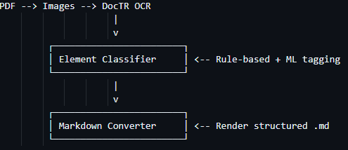

# PDF-Parsing

Pipeline to parse PDF files and convert them into structured Markdown using a combination of models that are time efficient.

This project is a high-performance pipeline that converts PDF documents into clean, structured Markdown using multiple specialized models. It supports extraction of:

Text blocks (via EasyOCR)

Tables (via pdfplumber)

Code blocks 

Figures (via yifeihu/TF-ID large)

Hyperlinks & metadata (via PyMuPDF)

It’s designed for accuracy, modularity, and speed, making it ideal for large-scale document parsing or archiving workflows.